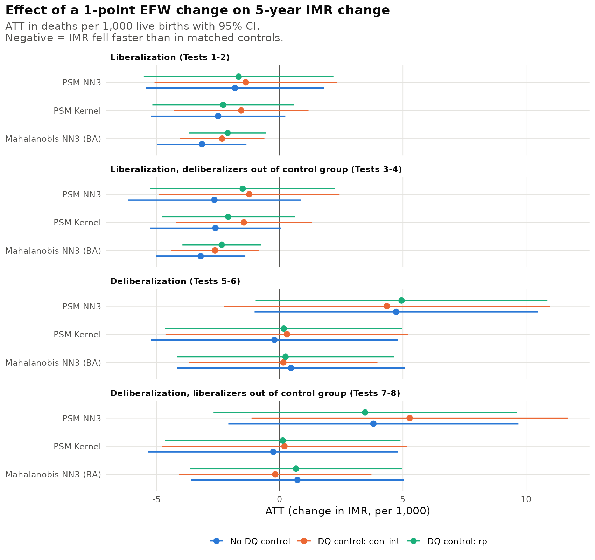
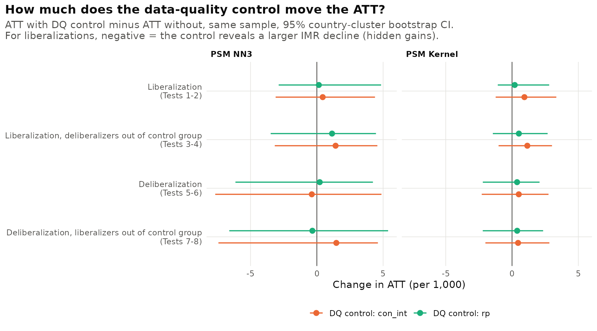
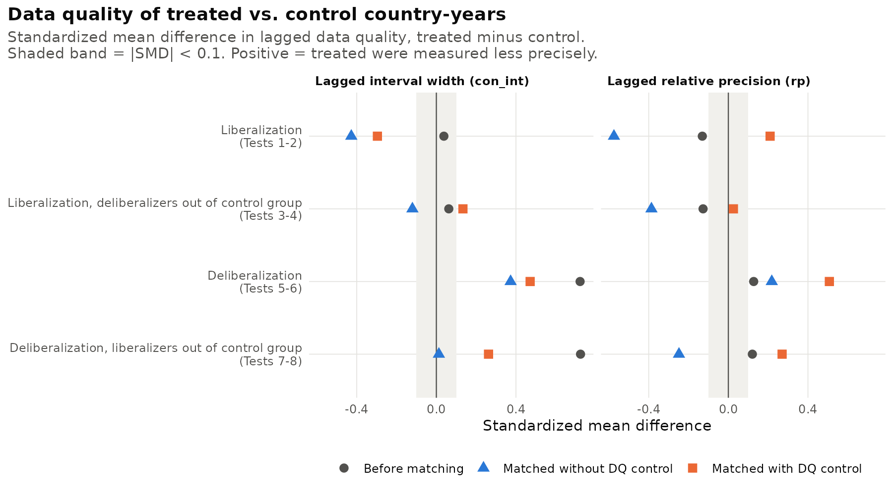
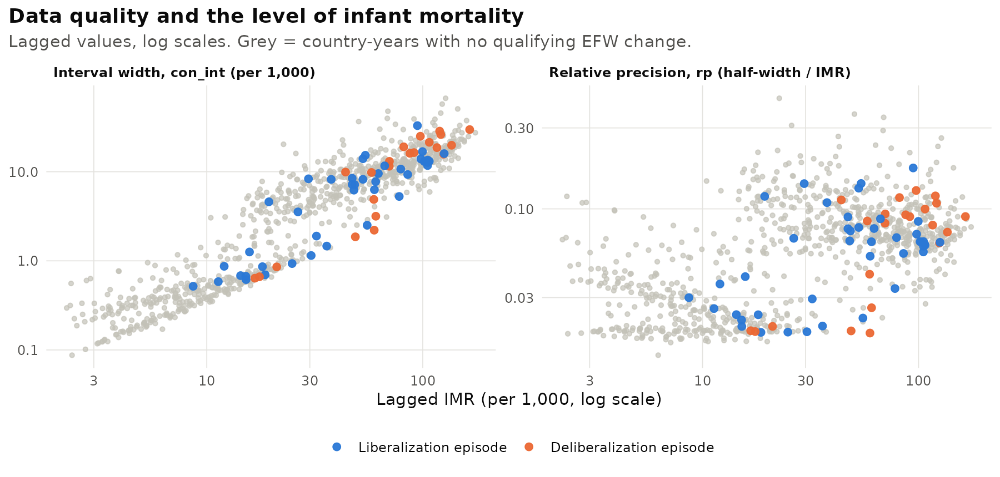

*Latest results, Geloso & Wilhelm, 7 October 2026.*

## Research question

When a country liberalizes, does infant mortality fall faster than it would have after accounting for data quality (or how well infant mortality is measured)?

*Hypothesis & Eric Commentary:* Countries with weak statistical systems (potentially associated with weak state capacity) have infant mortality data series that are largely modelled or subject to error rather than observed. States with higher administrative capacity could collect information nearing a universal census (subject to some cost of administrative burden) or implement a sophisticated sample survey to closely approximate the social phenomenon being measured. Either way, data quality *could* be partly driving the development-related improvements. If liberalizers tend to be measured worse (or better) than the countries they are compared with, part of any measured effect may be an artifact of data quality. For this analysis, data quality enters only as a **control**, not an outcome. **We estimate the effect of large changes in economic freedom with and without controlling for data quality ("DQ") and ask how much the estimate moves.**

## Design

**Treatments.** A *liberalization* is a rise of at least 1 point in the Fraser EFW summary index over a 5-year period; a *deliberalization* is a fall of at least 1 point. Episodes follow Callais & Young (2023): a period is dropped if the previous period or the one before it was an episode, or if the next one is, so the first episode of a sustained reform counts and its follow-on periods do not. That gives 48 liberalizations and 24 deliberalizations (43 and 22 with complete covariates). Liberalizations cluster in 1990–2000 (Nicaragua, Uganda, Argentina, Peru and El Salvador in 1990–95 are the largest); more than half of the deliberalizations are in 1970–75.

**New Design Contribution.** Consider both *deliberalizers* along with *liberalizers* for symmetry to investigate impacts on IM and corresponding deterioration in data quality.

**Outcome.** The 5-year change in the UN IGME infant mortality rate (deaths per 1,000 live births).

**Data-quality control.** The width of the lagged UN IGME 90% uncertainty interval (`con_int`), and as an alternative its relative precision (`rp`, half-width divided by the IMR level). Both are measured in the period before treatment, so they cannot be affected by it.

**Matching.** Treated country-years are matched to untreated ones on lagged EFW, human capital, log GDP per capita and its square, 5-year GDP growth, fertility, old-age dependency, Polity2, urbanization and lagged IMR (the Callais & Young covariates plus the lagged outcome). Three estimators: propensity-score matching with three nearest neighbours (NN3), Epanechnikov kernel propensity-score matching, and Mahalanobis NN3 with Abadie–Imbens bias adjustment. Standard errors for the two propensity-score estimators come from a 200-replication bootstrap that resamples whole countries.

**The eight tests.** Tests 1–4 treat liberalizations, Tests 5–8 deliberalizations. Even-numbered tests add the data-quality control. Tests 3–4 drop every deliberalization episode from the control group, and Tests 7–8 drop every liberalization episode. Each pair (1–2, 3–4, 5–6, 7–8) is estimated on the **same sample**, so any gap between the two estimates comes from the control alone, and each bootstrap draw re-estimates both, which gives a standard error for the gap.

## Results

### 1. Liberalizations are followed by faster declines in infant mortality

*Figure 1. Average treatment effect on the treated, 95% confidence intervals.*

Without the data-quality control (Test 1), infant mortality in liberalizing countries fell by **1.8 to 3.2 more deaths per 1,000** over five years than in matched countries. Over the same period, untreated countries' infant mortality fell by 5.9 per 1,000 on average, so the effect is roughly a third to a half of the typical 5-year decline. The Mahalanobis estimate (−3.16, SE 0.92) is significant at 1%, the kernel estimate (−2.50, SE 1.39) at 10%, and the NN3 estimate (−1.82, SE 1.84) is not significant. Removing deliberalizers from the control group (Test 3) makes the estimates slightly larger (−2.6 to −3.2). A simple regression with year fixed effects and country-clustered errors gives the same picture: **−3.36 (SE 0.89)**.

Deliberalizations (Tests 5–8) show no reliable effect. Point estimates range from −0.3 to +5.3 per 1,000 and none is significant. With 22 episodes, most of them in the early 1970s when IGME estimates are least precise, these tests have little power.

| Test | Treatment | DQ control | PSM NN3 | PSM Kernel | Mahalanobis NN3 |
|----|----|----|----|----|----|
| 1 | Liberalization | none | −1.82 (1.84) | −2.50\* (1.39) | −3.16\*\*\* (0.92) |
| 2 | Liberalization | `con_int` | −1.38 (1.89) | −1.56 (1.39) | −2.34\*\*\* (0.88) |
| 3 | Liberalization, no deliberalizers in control group | none | −2.65 (1.79) | −2.61\* (1.36) | −3.21\*\*\* (0.93) |
| 4 | Liberalization, no deliberalizers in control group | `con_int` | −1.24 (1.87) | −1.45 (1.41) | −2.62\*\*\* (0.91) |
| 5 | Deliberalization | none | 4.73 (2.93) | −0.22 (2.55) | 0.46 (2.36) |
| 6 | Deliberalization | `con_int` | 4.35 (3.38) | 0.29 (2.51) | 0.15 (1.95) |
| 7 | Deliberalization, no liberalizers in control group | none | 3.80 (3.00) | −0.26 (2.59) | 0.72 (2.21) |
| 8 | Deliberalization, no liberalizers in control group | `con_int` | 5.27 (3.27) | 0.19 (2.54) | −0.18 (1.99) |

*ATT in deaths per 1,000 over 5 years; standard errors in parentheses. \* p\<0.10, \*\* p\<0.05, \*\*\* p\<0.01. Results with relative precision (`rp`) are in `Results/tables/att_all_tests.csv`.*

### 2. Data quality is not hiding gains; if anything it slightly inflates them

*Figure 2. ATT with the data-quality control minus ATT without, same sample, 95% bootstrap interval.*

The pitch of the paper is "how much is data quality hiding gains?" In this sample the answer is **none**. Adding the interval-width control makes the liberalization effect **smaller**, not larger: by 0.4 (NN3), 0.9 (kernel) and 0.8 (Mahalanobis) deaths per 1,000 in Tests 1–2, which is 24–37% of the unadjusted estimate, and by 0.6 to 1.4 in Tests 3–4. With relative precision as the control, the shrinkage is 0.2 to 1.0 in Tests 1–2 and 0.5 to 1.1 in Tests 3–4. In the year-fixed-effects regression, the estimate goes from −3.36 to −3.06 (9% smaller). None of these shifts is statistically distinguishable from zero: the bootstrap standard error of the shift is about 1.1 for the kernel estimator and 2.0 for NN3. The Mahalanobis liberalization effect stays significant at 1% with either control (−2.34 with `con_int`, −2.11 with `rp`).

For deliberalizations the control moves the estimates by less than 1.5 per 1,000 in either direction, with no consistent sign.

### 3. Why the estimate moves: liberalizers were measured a little better than their matches

*Figure 3. Standardized mean difference in lagged data quality, treated minus control.*

Before matching, liberalizers and other country-years have about the same interval width (standardized difference 0.04). Matching on income, demography and lagged IMR, but not on data quality, pairs liberalizers with countries whose intervals were wider (standardized difference −0.43 for `con_int`, −0.58 for `rp`). In other words, liberalizers were measured somewhat more precisely than the countries they were compared with. Adding the control narrows that gap, and the estimated effect shrinks accordingly. Our reading (an inference, not something these tests establish) is that IGME series for weakly measured countries are pulled toward a smooth model trend, so the measured declines of poorly measured comparison countries are not directly comparable with those of better-measured liberalizers. For deliberalizers the pattern is the reverse: they were measured much worse than average before matching (standardized difference 0.72), and matching on lagged IMR removes most of that gap.

The propensity-score NN3 estimator does not fully balance data quality even when it is included (standardized difference −0.30 in Test 2). With 43 treated episodes and 11 covariates, the Mahalanobis estimator with bias adjustment is the most reliable of the three, and its results are the steadiest.

### 4. The two data-quality measures carry different information

*Figure 4. Lagged interval width and relative precision against lagged IMR, log scales.*

Interval width rises almost one-for-one with the IMR level (correlation 0.83 with lagged IMR in the estimation sample): a country with an IMR of 100 has an interval 30 or more times wider than one with an IMR of 5, even with the same statistical system. Because lagged IMR is already a matching covariate, `con_int` adds limited independent information. Relative precision is much less tied to the level (correlation 0.31) and is closer to a pure measure of measurement quality, but it becomes noisy where IMR is very low. Data quality measure proxy `con_int` makes the results easy to read in deaths per 1,000; we suggest reporting `rp` alongside it, since the two tell the same story here.

## What this means for the paper

1.  **The headline result holds up.** Large liberalizations are followed by infant mortality declines about 2–3 per 1,000 faster over five years, and controlling for data quality does not overturn this.
2.  **The "hidden gains" pitch needs reframing.** The IGME interval does not hide gains in 1975–2015; controlling for it trims the estimate by roughly a tenth to a third, and that change is not statistically significant. A more accurate framing: *"accounting for data quality, the gains are robust and, if anything, slightly smaller."*
3.  **Add 2020.** My student Research Assistant is pulling data through 2020. The IGME data for 2025 isn't published until March 2027. I'm thinking about ending our analysis in 2024 (as a placeholder for 2025/today).
4.  **A sharper data-quality measure may change the answer.** The IGME interval is mostly a function of the IMR level. The World Bank Statistical Capacity Indicator that my RA is assembling measures state statistical capacity directly, but it starts in 2004 and most liberalizations happened in the 1990s, so it would mainly help in the 2015–2020 extension. *The statistical capacity databases don't have the same time series length as the rest of our panel. We can discuss how to more directly address that alternative measure of "data quality".*
5.  **Deliberalizations need more episodes.** 22 episodes, mostly in the 1970s, cannot identify an effect; the 2020 extension and a 0.75-point threshold would help.
